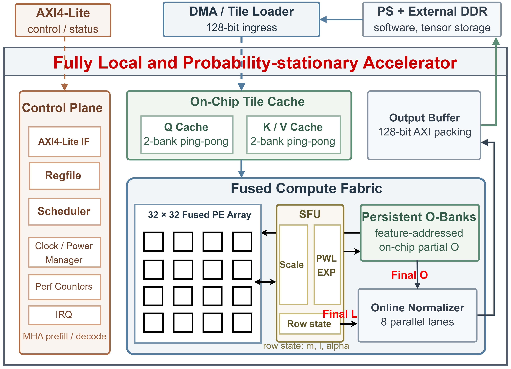
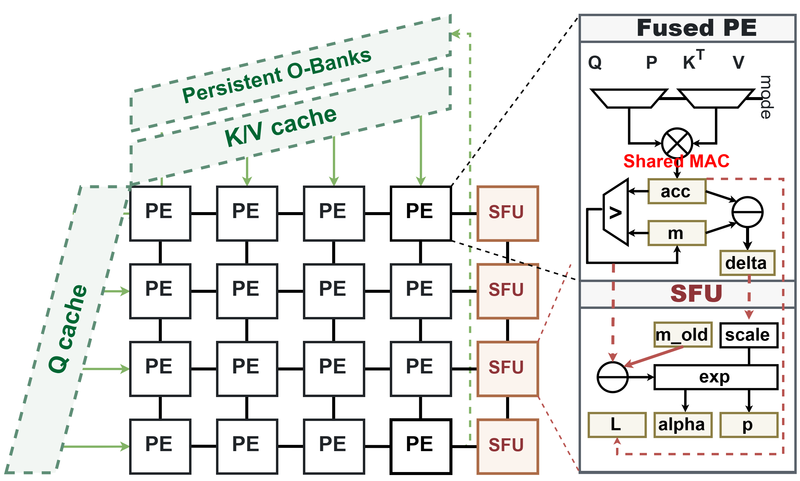
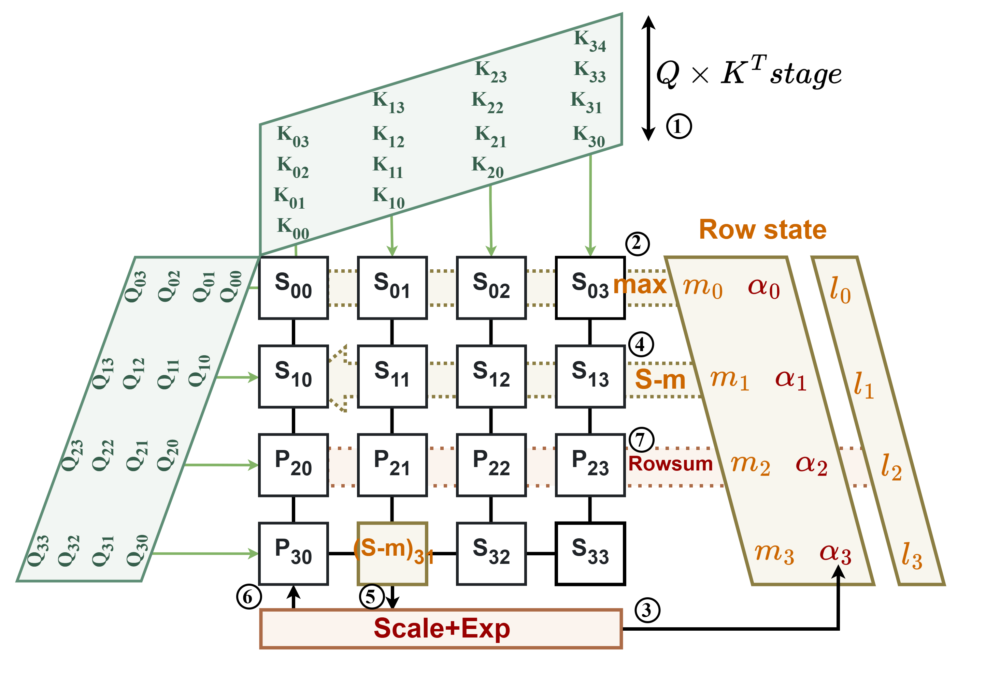
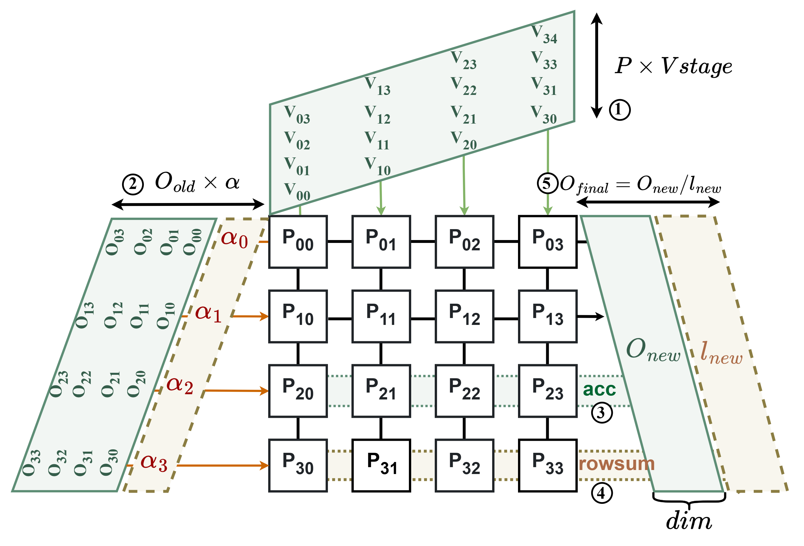

# FLOPA Technical Report

## 1. Purpose and Design Point

FLOPA (Fully Local, Overlapped Probability-stationary Attention Accelerator)
implements fixed-point scaled dot-product attention with a 32 x 32 fused
systolic PE fabric. The design point is batch-1 MHA with `Bq = Bk = 32` and
`head_dim = 64`. Q, K, and V are signed INT8; the softmax probability and
online rescaling factor are unsigned Q1.15; score, online state, and persistent
output accumulators are 32-bit.

The central goal is to avoid exporting a full score tile or probability tile
from the compute array. Score reduction, subtraction, probability retention,
rowsum, and PV accumulation occur in or immediately adjacent to the PE stripes.
Only feature-addressed O-bank reads and final normalized results cross the
array boundary.



*Figure 1. FLOPA system architecture. The control plane, ping-pong tile cache,
fused compute fabric, persistent O banks, online normalizer, and output path
are shown at their implemented architectural boundaries. The external DMA / tile
loader remains a system-integration component rather than an AXI read master
inside the accelerator.*

## 2. Algorithm and Fixed-Point Contract

For each query tile `Qr` and key/value tile `(Kc,Vc)`, FLOPA implements the
online FlashAttention recurrence:

```text
S[i,k]       = dot(Qr[i,:], Kc[k,:])
block_m[i]   = max_k S[i,k]
m_new[i]     = max(m_old[i], block_m[i])
alpha[i]     = exp(m_old[i] - m_new[i])
P[i,k]       = exp(S[i,k] - m_new[i])
block_l[i]   = sum_k P[i,k]
l_new[i]     = alpha[i] * l_old[i] + block_l[i]
O_new[i,d]   = alpha[i] * O_old[i,d] + sum_k P[i,k] * Vc[k,d]
O_final[i,d] = requantize(O_new[i,d] / l_new[i])
```

`m_old=-infinity`, `l_old=0`, and `O_old=0` are selected for the first KV tile.
For all later KV tiles, `(m,l,O)` remains on chip. This is an online recurrence:
the design does not store the score matrix in an SRAM and does not write P to
external memory.

| Quantity | Representation | RTL location / use |
| --- | --- | --- |
| Q/K/V cache and array links | signed INT8 | `qkv_tile_cache`, QK/PV engines, PE input links |
| QK score and PE accumulator | signed INT32 | phase-shared PE `accum_q` |
| scaled score/PWL input | signed 16-bit, Q8-style | `score_scale_pipe` output |
| `P` and `alpha` | unsigned Q1.15, 16-bit | PE `prob_q`, row-state alpha storage |
| `m`, `l`, and O accumulator | 32-bit | fused-array row state and stripe O banks |
| normalized output | signed INT8 | `online_normalizer`, `output_buffer` |

The score scale pipeline and PWL exponential are latency-pipelined. One
32-element score column is accepted each cycle, and all 32 elements are
processed concurrently by independent score-scale and PWL-exp lanes. The final
normalizer uses reciprocal lookup, two staged multiplier wrappers, shift-first
rounding, and signed INT8 saturation.

### 2.1 Softmax Approximation and Parallelism

`pwl_exp_unit.v` accepts a non-positive 16-bit Q8 delta and emits Q1.15. It
clamps `x >= 0` to one and `x <= -8` to zero. The current table contains eight
active unit-width PWL intervals on `[-8, 0]`, with linear interpolation inside
each interval. This is the actual implementation and must not be described as
more accurate than it is.

The architecture provides
32 parallel score-scale/PWL-exp lanes, one per row of the 32 x 32 PE array, so
each accepted score column produces 32 nonlinear evaluations in parallel. It
therefore satisfies the required parallelism with a factor of two margin.

## 3. Storage Architecture

The table separates capacity from logical lifetime. Capacity values describe
the default elaborated 32 x 32 x 64 configuration.

| Storage | Organization | Capacity | Lifetime / function |
| --- | --- | ---: | --- |
| Q cache | 2 banks x 64 features x 32 INT8 lanes | 4 KiB | one active/next Q tile |
| K cache | 2 banks x 64 features x 32 INT8 lanes | 4 KiB | active and refill KV tiles |
| V cache | 2 banks x 64 features x 32 INT8 lanes | 4 KiB | feature-major source for PV |
| Combined KV cache | K plus V ping-pong storage | 8 KiB | exceeds the 4 KiB KV-cache requirement |
| PE score state | 32 x 32 x INT32 | 4 KiB | output-stationary QK; overwritten by delta |
| PE probability state | 32 x 32 x Q1.15 | 2 KiB | P-stationary WS-PV weight |
| row state | `m`, `l`, alpha, row-valid | about 320 B | online recurrence across KV tiles |
| persistent O banks | 32 rows x 64 features x INT32 | 8 KiB | partial O retained across KV tiles |
| output buffer | 32 rows x 64 INT8 | 2 KiB | packs normalized output for AXI bursts |

The Q/K/V cache uses 256-bit logical words, each containing 32 INT8 lanes. The
128-bit input loader transfers each word as two halves. In an ASIC build, the
memory wrappers compose `/data/public` `uhdsp_256x8m4s` macros. In an FPGA
build, the same behavioral memory structure is intended to infer BRAM/URAM;
final RAM inference must be confirmed in Vivado rather than assumed.

### 3.1 Ping-Pong Policy

The tile cache records valid/active/next state separately for Q and KV.
Q persists through every KV tile belonging to a Q tile. K/V are consumed after
PV and can be refilled into the inactive bank while the active bank is read.
The 2 x 2 UVM sequence exercises both bank transitions, including bank refill
during writeback.

### 3.2 Persistent O-Bank Policy

The O bank is addressed by `(stripe, row-in-stripe, feature)`. For a non-first
KV tile, the bank returns `O_old[:,d]` while `V[:,d]` is issued. A registered
rescale path forms `alpha * O_old[:,d]` and injects it as the left-edge seed
for WS-PV. The array emits `O_new[:,d]` at its right edge with the same feature
tag, so the result writes directly back to the corresponding O-bank address.

This removes a per-row, per-feature-group preload before non-first KV tiles.
The two 32-feature physical groups are memory banks, not serial compute
halves: all 64 feature IDs are issued as one continuous stream.

## 4. External Interfaces and Programming Model

`attention_accel_top` integrates three visible interfaces.

| Interface | Width / protocol | Role | Status |
| --- | --- | --- | --- |
| AXI4-Lite slave | 32-bit data/control | configuration, START, status, performance counters | implemented |
| tile loader | 128-bit payload, kind/bank/address/half/valid-ready sideband | fills Q/K/V cache words | implemented integration port |
| AXI4 master write | 128-bit data | normalized O-tile burst writeback | implemented |

The data input is not an AXI4 read master. A system using PS DDR, such as a
VCK190 design, must place an AXI DMA MM2S path or a custom AXI4-to-tile-loader
adapter in front of the accelerator. AXI4-Lite is only for programming; it is
not the bulk tensor path.

### 4.1 Main Control Registers

The complete 36-register address map, bit fields, access policies, reset
values, error codes, programming sequence, and top-level signal contracts are
specified in [Register and Interface Reference](register_and_interface_reference.md).
The RTL source of truth is `rtl/common/attention_defines.vh` together with
`rtl/control/accel_regfile.v`.

| Register class | Important fields | Notes |
| --- | --- | --- |
| `CONTROL`, `STATUS`, `ERROR_CODE` | start, soft reset, clear done/error, mode, causal, prefill/decode | START captures a configuration snapshot |
| tensor addresses and strides | Q/K/V/O base and stride addresses | O base/stride are active; Q/K/V addresses remain legal RAZ/WI placeholders for a future DMA reader |
| shape | `SEQ_Q`, `SEQ_KV`, Q/KV heads, head dimension, tile dimensions | tile and head dimensions are validated against the elaborated design point |
| numeric controls | score, value, and output scale; mask config | score and output scales are active; unused `VALUE_SCALE`/`MASK_CFG` addresses are RAZ/WI and have no RTL state |
| counters | cycles, stalls, MACs, tiles | used for performance instrumentation, not yet a board-level sign-off source |

One non-obvious software requirement is that every `CONTROL` command write
also replaces the mode bits in `CONTROL[7:4]`. Prefill START is therefore
`0x41`, and decode START is `0x81`; writing only `0x1` clears both mode enables
and is rejected as `BAD_CFG`. See the reference document for the complete
register table and command values.

### 4.2 Supported Runtime Modes

| Mode | Legal configuration | Verification status |
| --- | --- | --- |
| MHA prefill | `prefill=1`, `decode=0`, 32-token tile geometry, MHA head mapping | 21-run suite includes one/two-tile, two-head, tail, and 512 x 512 cases |
| MHA decode | `prefill=0`, `decode=1`, `seq_q=1` | smoke plus causal/non-causal 256-token multi-KV-tile tests pass |
| causal masking | prefill or decode configuration with causal enable | tested |
| GQA | unequal Q/KV head counts | explicitly rejected at START; future work |

The bit-exact system regression covers prefill through 512 x 512 and decode
through one query by 256 keys. Larger decode contexts use the same KV-tile loop
but require fresh regression and external-loader bandwidth evidence.

## 5. Fused Compute Dataflow



*Figure 2. Design overview of the fused fabric. Q and K enter the 32 x 32 PE
array through orthogonal systolic links, probability remains stationary in the
PEs during PV, and feature-addressed persistent O banks retain partial outputs
across KV tiles. The inset summarizes the phase-shared PE arithmetic and local
softmax state.*

### 5.1 QK and Row Maximum

Q enters from the left and K enters from the top through registered skew links.
PE `(row, column)` accumulates one signed INT8 product per feature cycle into
its phase-shared 32-bit accumulator. Completion is staggered by column. As a
column completes, it immediately participates in a left-to-right row-maximum
reduction. The resulting `m_new` returns right-to-left; each PE subtracts it
from its local score and reuses the accumulator register for the delta.

No packed 32 x 32 score bus is exported to a separate softmax engine. This
avoids both a wide global connection and a variable-index giant multiplexer.

### 5.2 Column-Streamed Exp and Rowsum

When `score - m_new` becomes ready for one column, all 32 row values of that
column enter the scale/PWL-exp lanes together. The scale pipeline has latency
5 and PWL latency 3, so `EXP_LATENCY=8`; initiation interval is one column per
cycle. A delayed column tag returns each probability vector to its original PE
column. A reverse rowsum wave follows the probability writeback, allowing
subtraction, exp, probability retention, and rowsum to overlap.

After all row sums are captured, a single II=1 multiply pipeline updates one
`l_new` row per cycle from streamed `old_l`, alpha, and block-sum data. WS-PV
starts from `softmax_pv_ready` before this serial row-state update fully drains;
a sticky completion guard prevents release of the KV tile until both operations
finish.



*Figure 3. QK and online-softmax dataflow. Output-stationary score accumulation
is followed by an in-array row-maximum wave, reverse `S-m_new` propagation,
32-lane scale/PWL-exp processing, probability return, and reverse rowsum. The
illustrated 4 x 4 fabric is a compact representation of the implemented 32 x 32
array.*

### 5.3 Probability-Stationary WS-PV

P remains in PE `(i,k)`. For each feature `d`, V cache supplies the 32-lane
vector `V[:,d]`. It reuses the QK vertical data-link structure, and horizontal
partial sums form:

```text
seed[i,d] + P[i,0]*V[0,d] + ... + P[i,31]*V[31,d]
```

The seed is zero for the first KV tile and the alpha-rescaled persistent O-bank
value afterwards. Feature `d` travels with the PV payload, which prevents the
previous class of `d -> d+1` read/write alignment defects. Sixty-four features
are launched continuously; there is no compute restart at the physical O-bank
group boundary.



*Figure 4. Probability-stationary WS-PV dataflow. Each stored probability
multiplies the feature-major V stream, while `alpha*O_old` enters as the
left-edge seed. The right-edge result is tagged by feature and written directly
to the corresponding persistent O-bank address; final normalization is applied
only after the last KV tile.*

### 5.4 Final Normalization and Writeback

After the final KV tile, the fused array serves one stripe/feature O-bank read
per cycle. `online_normalizer` processes eight rows in parallel, preserving the
stripe/feature tag through reciprocal, multiplication, rounding, and
saturation. `output_buffer` packs the results into 256-bit storage words, and
the AXI4 master emits 128-bit output bursts. A one-shot `axi_write_done` pulse
is shared by scheduler completion, Q-bank consumption, and output-address
advance so a level-held AXI response cannot consume the next Q tile twice.


*Figure 5. Dominant pipeline spans for one KV tile. Panel (a) shows overlap
among the QK tail, row maximum, reverse subtraction, score scaling, PWL exp,
rowsum, row-state update, and PV launch. Panel (b) shows continuous 64-feature
WS-PV issue, direct persistent O-bank update, and grouped final normalization.
The spans describe the no-backpressure datapath schedule; external loader and
AXI stalls are not included.*

## 6. Control, Power, and Physical Design Considerations

The scheduler phases are `LOAD_Q`, `LOAD_KV`, `QK`, `SOFTMAX`, `PV`,
`WRITEBACK`, `DONE`, and `ERROR`. Handshakes, rather than a fixed delay, drive
phase transitions. The array controller enforces QK/PV mutual exclusion.

`fa_clock_gate` is currently a root-clock passthrough in both ASIC and FPGA
builds. The mapped comparison baseline contains zero RTL ICGs and zero
tool-inserted ICGs. Module enables remain part of the control protocol and are
available for a future measured low-power comparison.

The current ASIC memory macros are capacity-inefficient for some O-bank
organizations. SRAM reshaping is intentionally deferred until after FPGA
bring-up; it must be evaluated with port conflicts, placement, macro aspect
ratio, and access latency, not just bit utilization.

## 7. Current PPA and Verification Results

### 7.1 ASIC Synthesis Baseline

The current reproducible ASIC baseline is a pre-layout Design Compiler result
for the 32 x 32, `HEAD_DIM=64` top level. It uses the TSMC 28 nm TT CCS
standard-cell library and the `uhdsp_256x8m4s_tt0p9v25c` SRAM library at 0.9 V
and 25 C. The logical target is 1.60 ns (625 MHz). These numbers exclude routed
interconnect and therefore do not represent post-route frequency or silicon
measurements.

| Metric | Current result |
| --- | ---: |
| Setup WNS / TNS / failing paths | 0.000 ns / 0.000 ns / 0 |
| Critical path | 1.49 ns, 60 logic levels |
| Total cell area | 2,438,964.94 library units |
| Fused-array area | 2,048,222.41 (84.0%) |
| Total cells | 1,524,232 |
| Combinational / sequential cells | 1,281,371 / 242,335 |
| Buffer / inverter cells | 252,342 |
| SRAM macros | 480 |

The 480 SRAM macros comprise 192 Q/K/V-cache macros, 256 persistent O-bank
macros, and 32 output-buffer macros. The current comparison baseline contains
zero RTL and zero tool-inserted integrated clock-gating cells.

### 7.2 Gate-SAIF Power Baseline

Activity was generated by a mapped-netlist VCS run of `fa_random_qkv_test` with
seed 301 and read by Power Compiler. The 64 x 64 MHA-prefill workload used a
1.60 ns clock, completed with zero UVM errors and fatals, and annotated nets,
ports, and pins at 100%. The SAIF window covered cycles 57 through 4336 (4,279
cycles, 6,846.4 ns). This is a zero-delay, pre-layout activity estimate without
SDF annotation.

| Metric | Current result |
| --- | ---: |
| Cell internal power | 630.4358 mW |
| Net switching power | 18.1893 mW |
| Total dynamic power | **648.6251 mW** |
| Leakage power | **9.8584 mW** |
| Total power | **658.4835 mW** |
| Gross sampled-job energy | 4.508 uJ |

The fused-array hierarchy accounts for 620.086 mW (94.2%) of total power,
including its register clock load and persistent O banks. The tile cache,
normalizer, output buffer, and register file account for 13.983, 12.470, 7.236,
and 2.227 mW, respectively.

### 7.3 Workload-Derived Performance and Verification

The sampled 64 x 64 workload performs 524,288 MACs across four 32 x 32 Q/KV
tile pairs and the QK and PV phases. The complete load, compute, normalization,
and writeback window averages 122.53 MAC/cycle or 76.58 GMAC/s at 625 MHz. The
32 x 32 array peak is 1,024 MAC/cycle or 640 GMAC/s. Gross energy efficiency is
8.60 pJ/MAC; these values are workload-derived rather than DDR-backed or
board-level sustained measurements.

The maintained fixed-seed regression passes 21 of 21 tests with 100.00%
functional coverage. Raw `tb_top` code coverage is 95.01%, the complete raw
merged score is 95.66%, and the reviewed DUT-scoped report is 96.00%. Waived
module-definition line/branch coverage is 95.23%/97.61%; individual condition
and toggle gaps remain classified in the auditable raw report. Prefill has been checked
through 512 x 512, while MHA decode
has been checked for one query and up to 256 KV tokens. Detailed report paths
and update rules are maintained in [PPA and Optimization](ppa_and_optimization.md)
and [Verification Report](verification_report.md).

### 7.4 FPGA Evaluation (Pending)

The VCK190 implementation and model-level measurements have not yet been
completed. The table below is intentionally a reporting template; `TBD` entries
must be replaced only by post-route reports or board measurements.

| Metric | VCK190 result |
| --- | ---: |
| Post-route Fmax | TBD |
| LUT / FF | TBD |
| DSP | TBD |
| BRAM / URAM | TBD |
| PS-to-PL and PL-to-DDR bandwidth | TBD |
| Re10K attention throughput / speedup | TBD |
| LLM prefill throughput / speedup | TBD |
| Board dynamic power / energy per attention | TBD |

## 8. Known Limits and Next Steps

1. Add a verified AXI4 read/DMA wrapper for Q/K/V ingress before claiming a
   complete PS-DDR system interface.
2. Retain the 32-lane score-scale/PWL-exp source and architecture evidence in
   the final submission to demonstrate the required greater-than-16 softmax
   parallelism.
3. Formally classify the remaining normalizer/engine condition and toggle gaps
   beyond the current 96.00% waived score while preserving 100.00% functional
   coverage and the auditable raw report.
4. Complete VCK190 implementation and report post-route Fmax, resource use,
   external-memory bandwidth, and measured board power.
5. Add native GQA and extend decode verification beyond the current 256-token
   KV context; current GQA is intentionally rejected rather than silently
   remapped.
